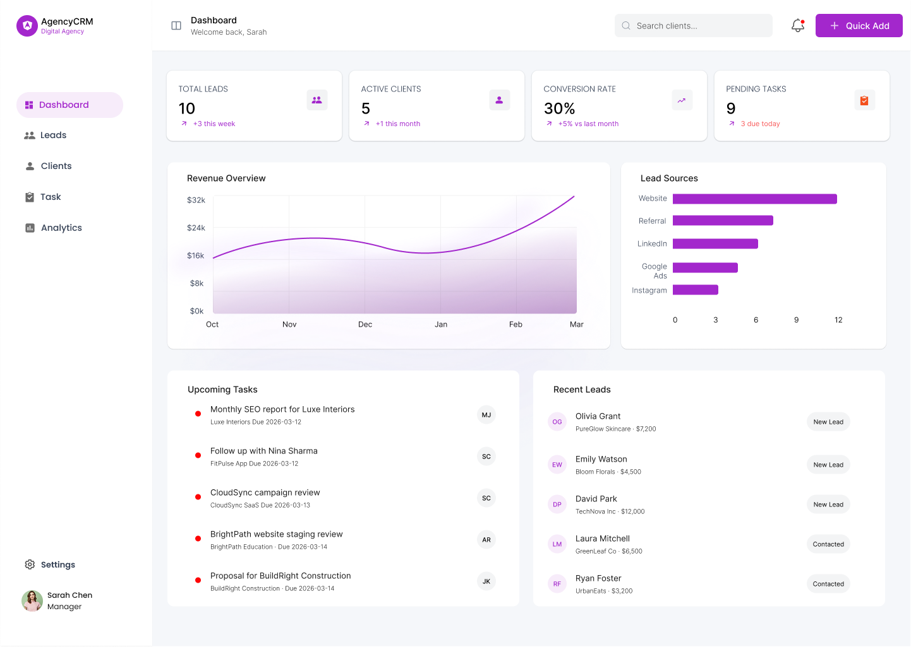
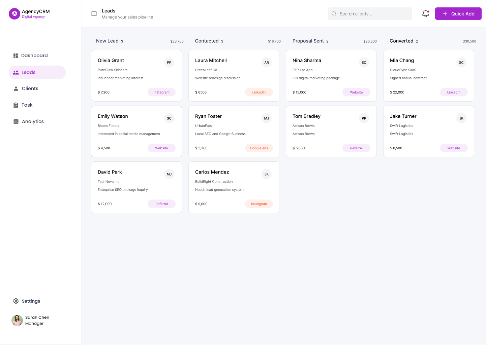
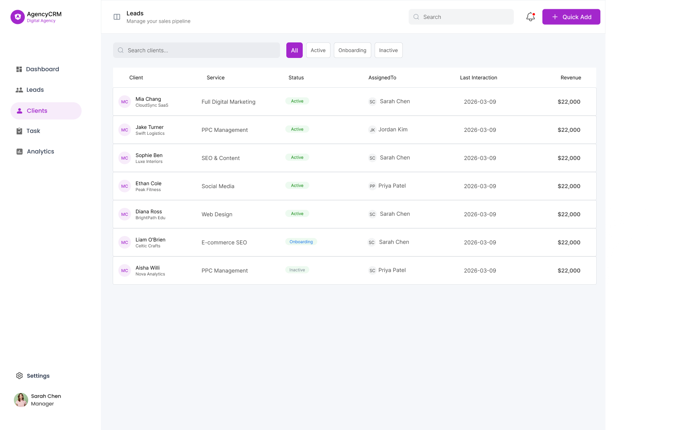
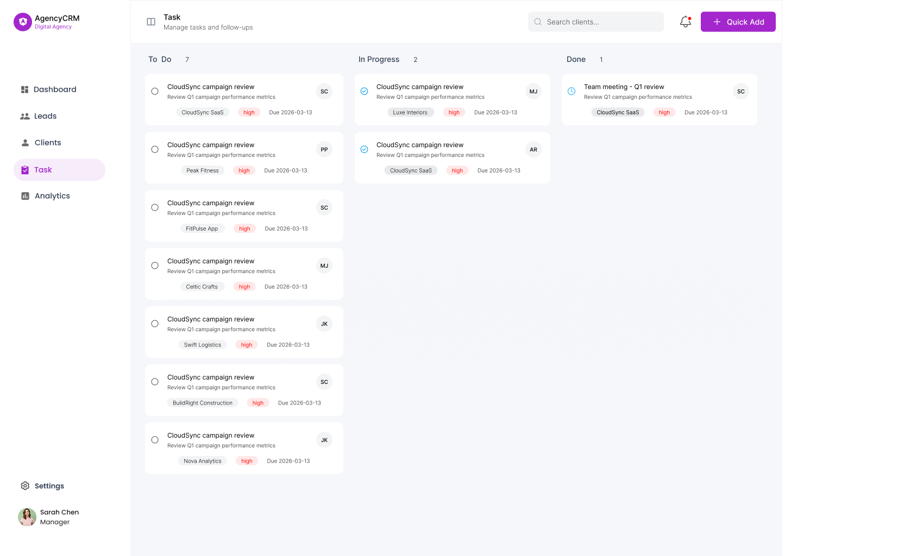
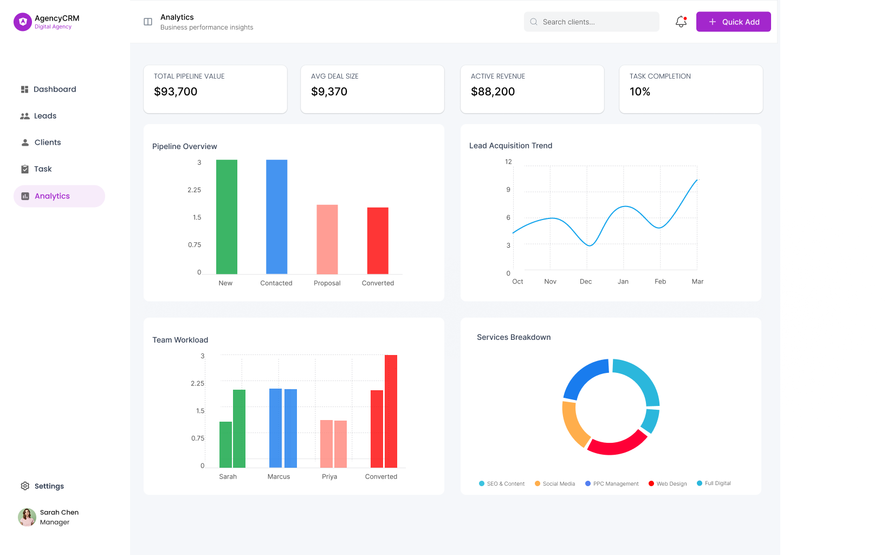
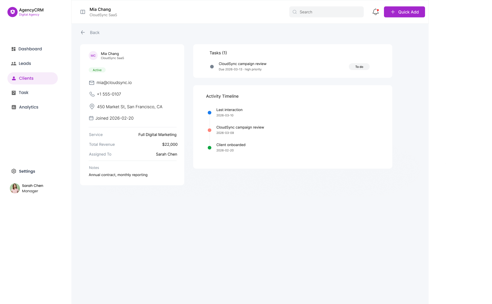
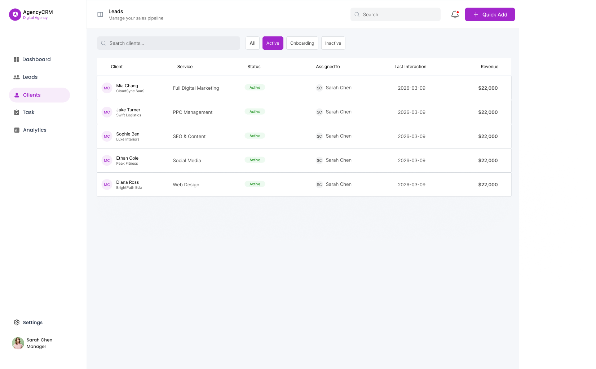
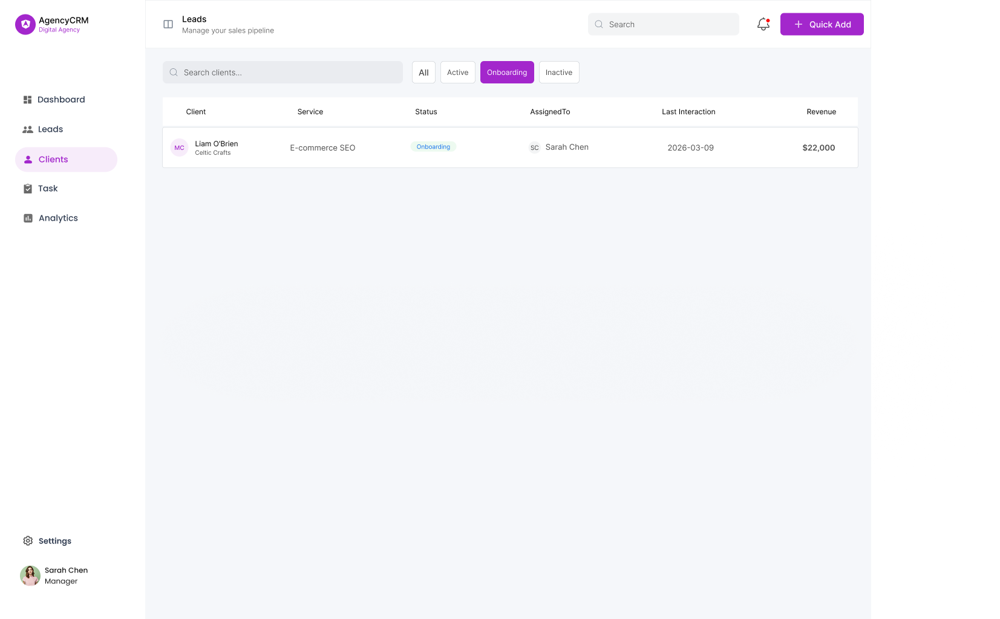
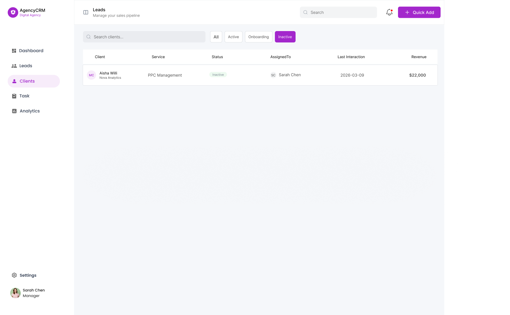

# FUTURE_UX_03
#### CRM dashboard for a 5-member digital agency managing 30+ clients.

### 1. Project Overview

This project focuses on designing a web-based CRM (Client Relationship Management) dashboard for small agencies to manage clients, track leads, and organize follow-ups efficiently.

Many small agencies still manage their clients using spreadsheets, messages, and basic tools. This creates problems such as missed follow-ups, disorganized data, and poor client management.

The goal of this project is to design a clear, scalable, and easy-to-use CRM dashboard that helps teams manage clients and leads in one plac

### 2. Problem Statement

Small agencies often face these challenges:

  ✔ Client information scattered across multiple tools

  ✔ Difficult lead tracking

  ✔ Missed follow-ups and communication gaps

  ✔ No clear visibility of sales progress

  ✔ Inefficient workflow for managing multiple clients

Because of these issues, agencies lose productivity and sometimes even potential clients.

A centralized CRM dashboard can help solve these problems.

### 3. Objective

The objective of this project is to design a modern CRM dashboard interface that allows users to:

👉 Track leads and client information

👉 Manage active clients

👉 View client engagement quickly

👉 Schedule tasks and follow-ups

👉 Monitor sales pipeline status

The design focuses on clarity, usability, and efficiency for daily business operations.

### 4. Target Users

#### Primary Users

Small agency teams such as:

   ✔ Digital marketing agencies

   ✔ Web design and development agencies

   ✔ SaaS consulting teams

   ✔ Freelancers managing multiple clients

 ####  User Characteristics

  Users typically:

  ✔ Handle many clients at the same time

  ✔ Need quick access to client data

  ✔ Want simple workflows without complexity

  ✔ Prefer visual dashboards instead of spreadsheets

### 5. Real-World Scenario

This CRM system is designed for a 5–10 member digital agency managing around 30+ clients.

Example workflow:

✔ A new lead contacts the agency

✔ The lead is added to the CRM system

✔ The team tracks communication and progress

✔ The lead becomes a client

✔ Tasks and follow-ups are managed through the dashboard

This allows agencies to manage their entire client lifecycle in one platform.

### 6. User Pain Points

| Pain Point                         | Impact                              |
| ---------------------------------- | ----------------------------------- |
| Client data stored in spreadsheets | Hard to manage and update           |
| Missed follow-ups                  | Loss of potential clients           |
| No clear pipeline tracking         | Difficult to monitor sales progress |
| Too many communication tools       | Workflow becomes messy              |

### 7. Design Goals

The design focuses on solving these problems by creating a dashboard that is:

Simple – Easy for teams to learn quickly

Organized – Clear structure for client data

Efficient – Reduces time spent managing clients

Scalable – Works for growing agencies

Insightful – Provides quick data overview

### 8. Key Screens Designed

   1.CRM Dashboard
   
   2.Lead Pipeline
   
   3.Client List
   
   4.Client Profile Page
   
   5.Task & Follow-up Manager
   

 ### Design Screenshots

 #### Dashboard, Leads, Clients, Task and Analytics Page
   <table>
 <tr>
    <td valign="top">
      
    </td>
    <td valign="top">
      
    </td>
  </tr>
</table>
<table>
 <tr>
    <td valign="top">
      
    </td>
    <td valign="top">
      
    </td>
    </td>
    <td valign="top">
      
    </td>
  </tr>
</table>
   
 #### Clients-profile, active-clients, clients-onboarding and inactive-clients Page
 
 <table>
 <tr>
    <td valign="top">
      
    </td>
    <td valign="top">
      
    </td>
  </tr>
</table>

<table>
 <tr>
    <td valign="top">
      
    </td>
    <td valign="top">
      
    </td>
  </tr>
</table>
